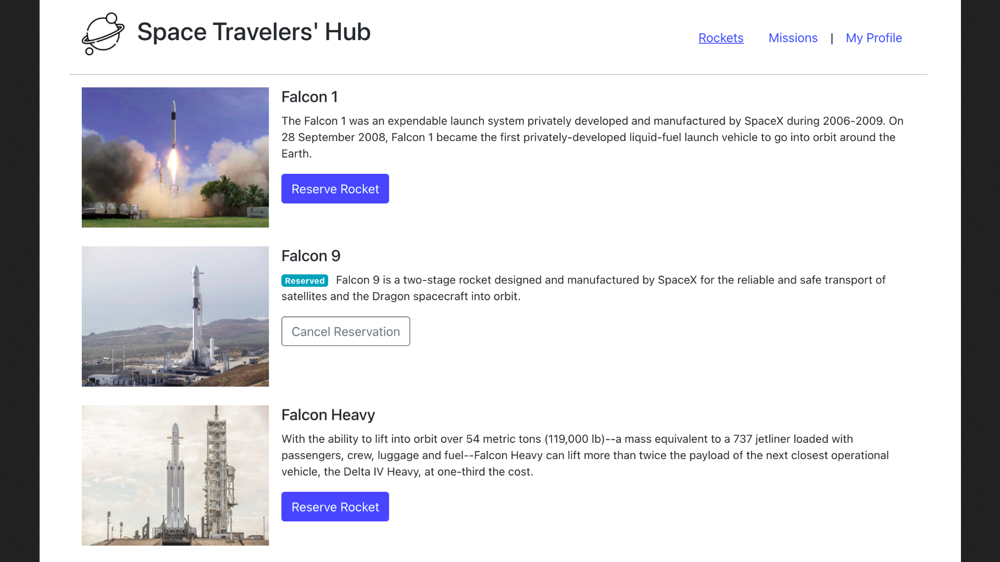

# Space Travelers' Hub

> Project that showcases Rockets and missions from the SpaceX API, the user can reserve Rockets and join Missions, and save them in his profile.

## Built With

- JavaScript, CSS
- React, Redux
- Webpack

## Live Demo

Check the live demo for this project [here](https://cosmos-travelers-hub.netlify.app/).

## Getting Started

To get a local copy up and running follow these simple example steps.

### Prerequisites

You need to be able to use Node Package Manager, or also called, the `npm` command.
If you dont have it, install it with these commands in the CLI (for Linux):

`curl -sL https://deb.nodesource.com/setup_12.x | sudo -E bash -`

`sudo apt install nodejs`

Then, run this command in the CLI:

`npm --version`

If the previous command prints a single line with a version number on screen, `npm` was installed.
### Install

First you need to clone the repository into the folder of your choice with this command:

`git clone https://github.com/Yothu/space-travelers-hub.git`

Then go inside the repository foler with this command:

`cd space-travelers-hub`

After you are inside, download the `npm` dependecies with this command:

`npm install`

Finally, show the project through the browser with this command:

`npm start`

### Usage

+ Once in the browser, you will see the **Rockets page**, in it you can click on the *Reserve Rocket* button to reserve a rocket, once a rocket is reserved, you can click on the *Cancel Reservation* button to cancel the reservation of the selected rocket.
+ Once you click on missions in the header you will be in the **Missions page**, in it you can click on the *Join Mission* button to join a mission,then you can click on the *Leave Mission* button to leave joined mission.
+ If you click on My Profile in the header you will be in your **Profile page**, there you will se the Rockets that you have reserved and the missions that you have joined.

## Author

👤 David Vergaray

- GitHub:   [@Yothu](https://github.com/Yothu)
- Twiter:   [@Daivhy](https://twitter.com/Daivhy)
- LinkedIn: [David Vergaray](https://www.linkedin.com/in/david-vergaray-almontes-051a11127/)

## 📝 License

This project is [MIT](./MIT.md) licensed.

## Show your support

Give a ⭐️ if you like this project!